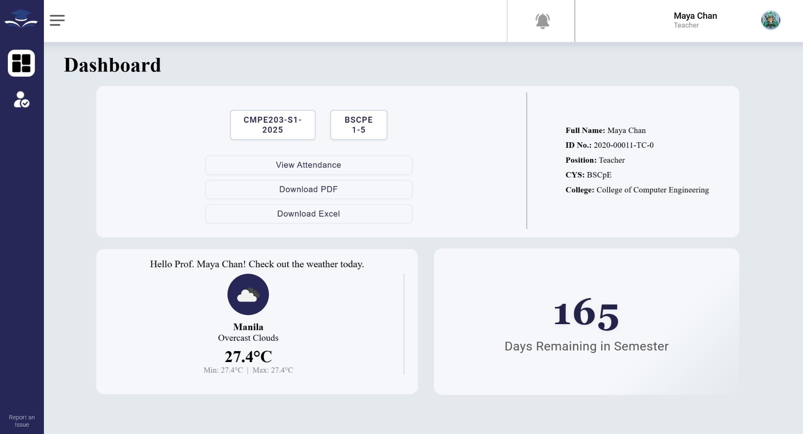
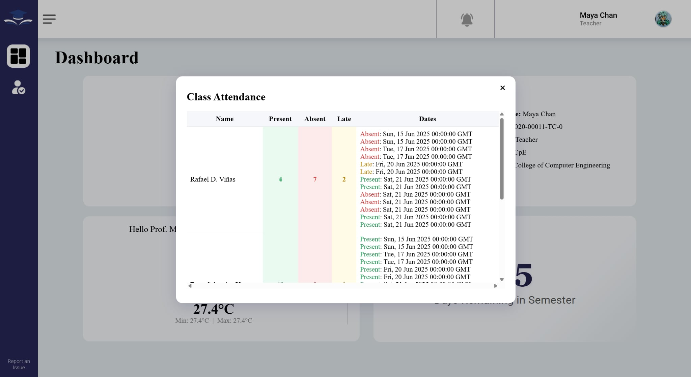
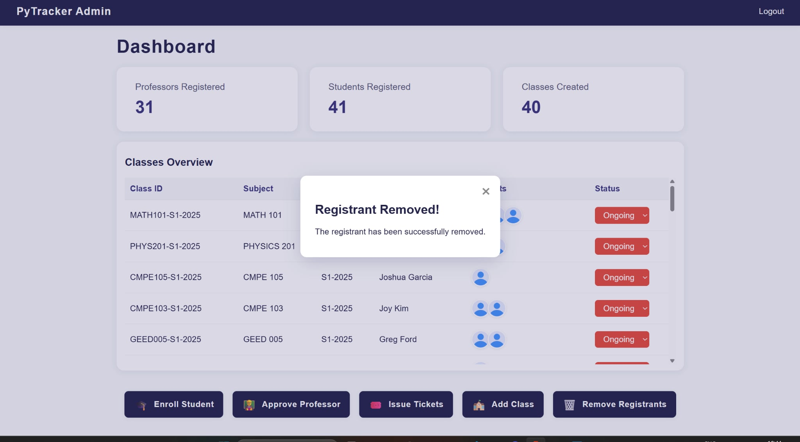

# 📚 PyTracker

A web-based attendance tracker designed for schools. Professors can take attendance, and the system records and displays each student's presence, lateness, or absence by date.

---

## 🛠 Features

- 🔐 User login system  
- 📝 Only enrolled students can register  
- 🧑‍🏫 Admin dashboard for trusted professors  
- 📅 Attendance tracking with date-wise records  
- 📊 Attendance reports (modal, PDF, and Excel export)  
- 📈 View student attendance history  

---

## 🧰 Technologies Used

- **Flask** (Python) – Backend web framework  
- **HTML, CSS, JavaScript** – Frontend  
- **MySQL** – Database  
- **Digital Ocean** – (Previously used for hosting)  

---

## 📷 Screenshots





---

## 🚀 How to Run

1. **Clone the repository:**
   ```bash
   git clone https://github.com/yourusername/pytracker-web.git
   cd pytracker-web
   ```

2. **Install dependencies:**
   ```bash
   pip install -r requirements.txt
   ```

3. **Set up the database:**
   - Create a MySQL database and update the connection settings in your configuration file (e.g., `config.py` or `.env`).
   - Import the provided SQL schema if available.

4. **Run the application:**
   ```bash
   flask run
   ```
   - Open your web browser and go to `http://localhost:5000`

---

## ⚠️ Limitations

- The hosted database on Digital Ocean has been deleted; you must set up your own Hosted MySQL database.
- Only enrolled students can register; others are blocked.
- No public demo currently available.

---

## 📚 Learning Goals

- Practice full-stack web development with Flask and MySQL  
- Implement user authentication and role-based access  
- Generate and export attendance reports  

---

## 📁 Project Structure

```
pytracker-web/
├── app.py
├── templates/
├── static/
├── requirements.txt
├── README.md
└── ...
```

---

## 🙋‍♂️ Author & Notes

- Developed as a school attendance tracking solution.
- For questions or contributions, open an issue or pull request.

---